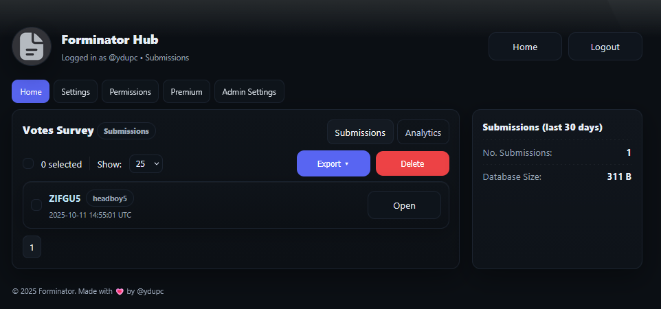

# Using Actions

<figure><figcaption></figcaption></figure>

**Available Actions Options:**

* DM User - Send a direct message to the user upon acceptance.
* Grant Roles - Gives the user roles.
* Remove Roles - Takes away selected roles.
* Delete Submission - Permanently Removes the submission

You are able to modify each button's colour amoung the basic Discord options, the emoji and the name.\
\
These buttons show up on embed messages, along with the submission viewer in the panel.

You can view the actions system from the form editor, then pressing "Actions".
